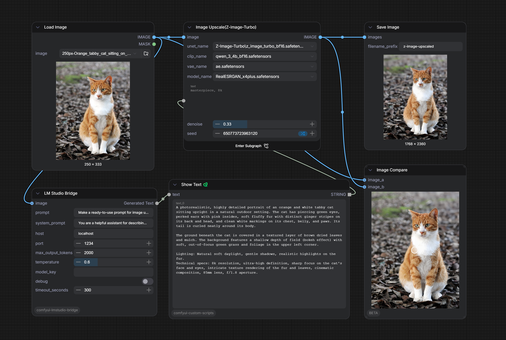

# ComfyUI LM Studio Bridge

[](https://opensource.org/licenses/MIT)
[](https://github.com/comfyanonymous/ComfyUI)

**LM Studio Bridge** is a single, powerful ComfyUI node that connects to [LM Studio](https://lmstudio.ai/)’s native REST API. Run LLMs and vision models locally and use them directly in your image‑generation workflows – for prompt enhancement, image captioning, style analysis, or any text‑to‑text / image‑to‑text task.

> 🚀 **Key features** – automatic model detection, adaptive image resizing, PNG optimisation, keep‑alive HTTP sessions, and full control over generation parameters.



---

## 📦 Installation

1. **Navigate to your ComfyUI `custom_nodes` directory**
   ```bash
   cd /path/to/ComfyUI/custom_nodes
   ```

2. **Clone this repository**
   ```bash
   git clone https://github.com/caradat/comfyui-lmstudio-bridge.git comfyui-lmstudio-bridge
   ```

3. **Install Python dependencies**  
   Activate your ComfyUI environment (venv/conda) and run:
   ```bash
   pip install requests Pillow numpy
   ```  
   (If a `requirements.txt` is present, you can use `pip install -r requirements.txt` instead.)

4. **Restart ComfyUI** – the node will appear under **`ComfyExpo/REST`** as **`LM Studio Bridge`**.

---

## 🚀 Getting Started

### 1. Prepare LM Studio
- Download and launch [LM Studio](https://lmstudio.ai/).
- Load a model (for image‑to‑text, ensure it’s a **vision model**, e.g. qwen35, gemma4, etc.).
- Go to the **Developer** tab (`<->`) and **start the server** (default port `1234`).
- (Optional) Note the `model_key` shown in LM Studio if you want to specify a model manually.

### 2. Use the Node in ComfyUI
- **Right‑click** → *Add Node* → search for `LM Studio Bridge`.
- Connect:
    - `prompt` (required) – your main text instruction.
    - `image` (optional) – connect an image if you use a vision model.
    - `model_key` (optional) – leave empty to auto‑detect the loaded model.
- Set generation parameters (`temperature`, `max_output_tokens`, etc.).
- Run the workflow – the generated text appears at the `Generated Text` output.

---

## 🔧 Node Reference

### LM Studio Bridge

| Input | Type | Default | Description |
|-------|------|---------|-------------|
| `prompt` | `STRING` | `"Make the ready-to-use prompt with the image description:"` | Main text prompt. |
| `system_prompt` | `STRING` | `"You are a helpful AI assistant."` | System instruction for the model. |
| `host` | `STRING` | `"localhost"` | LM Studio server hostname or IP. |
| `port` | `INT` | `1234` | LM Studio server port. |
| `max_output_tokens` | `INT` | `2000` (min 1, max 4096) | Maximum tokens in the response. |
| `temperature` | `FLOAT` | `0.6` (0.0–2.0, step 0.1) | Randomness – lower = more deterministic. |
| `image` | `IMAGE` (optional) | – | Image input for vision models. |
| `model_key` | `STRING` (optional) | `""` | Specific model ID. If empty, the first **loaded** model from LM Studio is used automatically. |
| `debug` | `BOOLEAN` | `False` | Enable verbose logging in the ComfyUI console. |
| `timeout_seconds` | `INT` | `300` (10–3600) | Request timeout. |

**Output:**
- `Generated Text` (`STRING`) – the model’s response.

> **Note on `IS_CHANGED`:** The node includes a hash of all inputs (including image data when present). This ensures that ComfyUI re‑executes the node whenever any parameter or the uploaded image changes.

---

## 🧠 Automatic Model Detection

If you leave `model_key` empty, the node:

1. Queries LM Studio’s `/api/v1/models` endpoint.
2. Finds the **first model that has at least one loaded instance** (field `loaded_instances` > 0).
3. Uses that model ID for the generation.

This makes switching models in LM Studio seamless – no need to update the node. In **debug mode**, the detected model ID is printed to the console.

---

## 🖼️ Image Optimisation

To reduce token usage and network latency (vision models encode images into tokens), the node automatically:

- **Resizes** images if either dimension exceeds **1536 px** (aspect ratio preserved).
- **Converts RGBA → RGB** when the alpha channel is fully opaque.
- **Saves as PNG** with `optimize=True` and `compress_level=6`.

These steps typically reduce image size by 50‑80% without noticeable quality loss.

---

## 🔁 Persistent HTTP Session

The node uses a single `requests.Session()` for all calls. This enables HTTP keep‑alive and connection reuse, improving performance when the node is executed multiple times in a workflow.

---

## 📡 API Format

This node uses LM Studio’s **native REST API** (not the OpenAI‑compatible endpoint).
- Endpoint: `/api/v1/chat`
- Payload format (text-only):
  ```json
  {
    "model": "...",
    "input": "your prompt",
    "system_prompt": "...",
    "max_output_tokens": 2000,
    "temperature": 0.6
  }
  ```
- For vision models, `input` becomes an array of objects:
  ```json
  "input": [
    {"type": "text", "content": "Describe this image"},
    {"type": "image", "data_url": "data:image/png;base64,..."}
  ]
  ```

Make sure your LM Studio server is using the **native API** (the default when you start the server).

---

## 🛠️ Troubleshooting

| Problem | Likely Fix |
|---------|-------------|
| `Error: Cannot connect to LM Studio server at host:port` | LM Studio must be **running** and the **server started** (button in the Server tab). |
| `Error: The LM Studio server is accessible, but no models are known. Load a model in LM Studio and try again.` | Load at least one model in LM Studio **before** starting the server. |
| `Error when requesting the model list: ...` | Check network connectivity or firewall. The node uses HTTP GET to `/api/v1/models`. |
| `Image encoding failed` | The input image tensor may be invalid. Try using a **Load Image** node and connect it directly. |
| `Error: Request to LM Studio server failed: ...` | Inspect the full error in the console; enable `debug=True` for more details. |
| Response is empty or `No content generated.` | The model may not have produced any output. Check your prompt and system prompt. |
| `Timeout after X seconds` | Increase `timeout_seconds` or check system load (some large models can be slow). |

**Enable `debug = True`** to see detailed logs:
- Model detection process
- Payload (truncated for large images)
- HTTP response status
- Preview of the generated text

---

## 📚 Example Workflow

1. **Load an image** (e.g., a photograph of a landscape).
2. **LM Studio Bridge** node:
    - `prompt`: `"Describe this image in one short sentence for use as a Stable Diffusion prompt."`
    - Connect the image to the `image` input.
    - `model_key`: leave empty (auto‑detects your loaded vision model).
    - `temperature`: `0.4` (more focused).
3. Connect the `Generated Text` output to a **Show Text** node.

Run the workflow – the model writes a caption. Then you can copy that caption into a positive prompt for Stable Diffusion.

> For a full visual example, see `workflow.png` in the repository.

---

## 📄 License

This project is licensed under the **MIT License** – see the [LICENSE](LICENSE) file for details.

---

## 🙏 Acknowledgements

- [ComfyUI](https://github.com/comfyanonymous/ComfyUI) – the incredible node‑based UI.
- [LM Studio](https://lmstudio.ai/) – making local LLMs easy to run and serve.
- Built by [caradat](https://github.com/caradat).